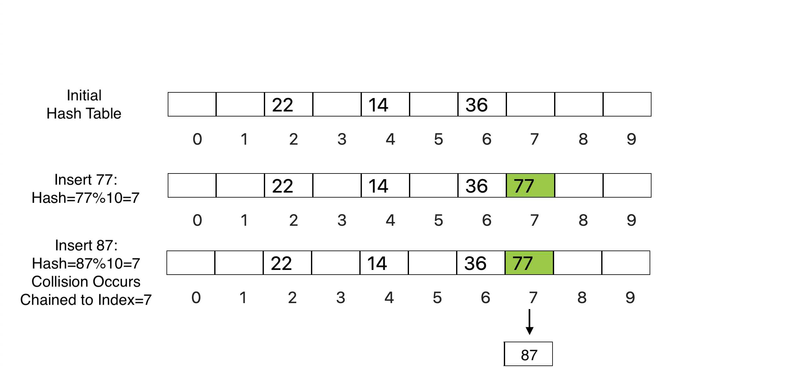

### What is Seperate Chaining?

Separate chaining is defined as a method by which linked lists of values are built in association with each location within the hash table when a collision occurs.
### Seperate Chaining Demonstration

