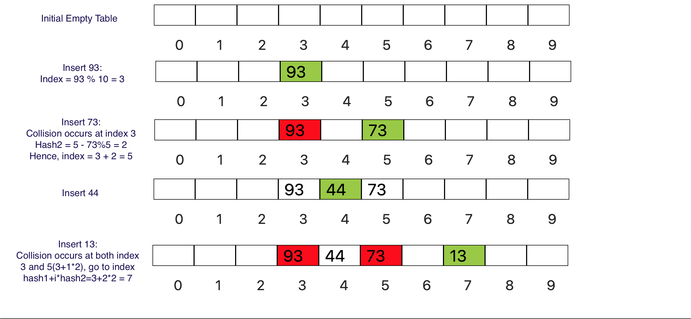

### What is double hashing?

Like linear probing, double hashing uses one hash value as a starting point and then repeatedly steps forward an interval until the desired value is located, an empty location is reached, or the entire table has been searched. But this interval is decided using a second, independent hash function (hence the name double hashing).

### Double Hashing Demonstration

