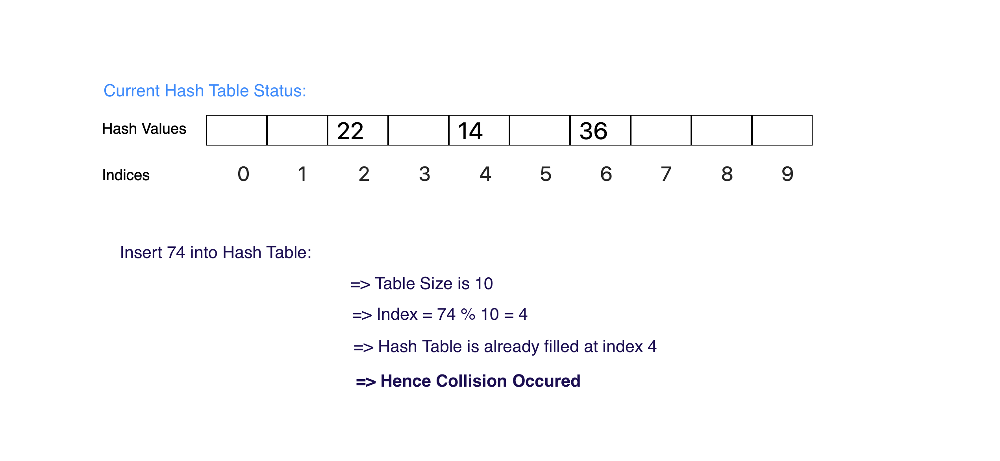
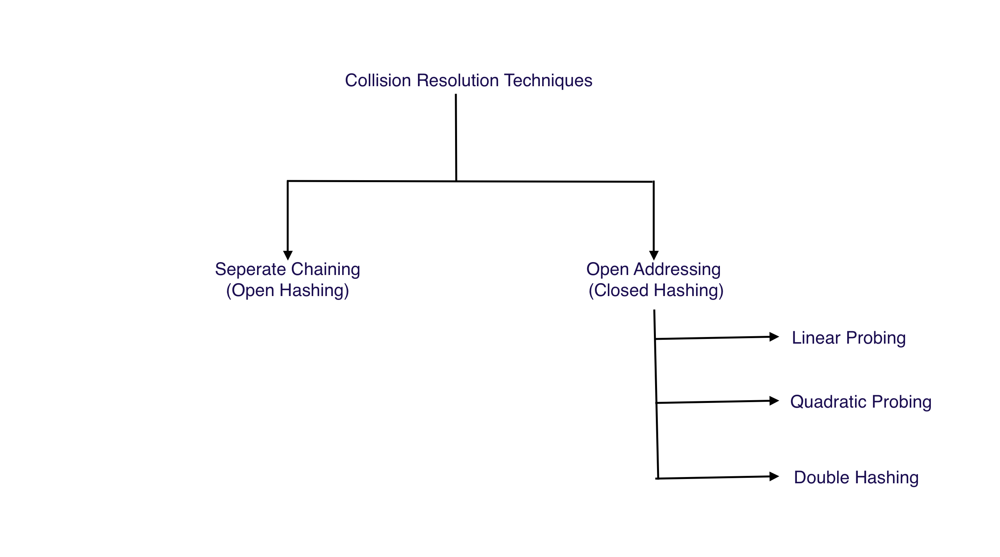

### Concept of Collisions Structure
<iframe src="https://www.youtube.com/embed/goLWVTPCPJc" frameborder="0" allow="autoplay; encrypted-media" allowfullscreen></iframe>

### What is collision?

Since a hash function gets us a small number for a key which is a big integer or string, there is a possibility that two keys result in the same value. The situation where a newly inserted key maps to an already occupied slot in the hash table is called collision and must be handled using some collision handling technique.

### Collisions Example

### Collisions Resolution Methods
There are mainly two types of methods to handle collision:
1. Separate Chaining
2. Open Addressing

### Collisions Resolution Techniques

