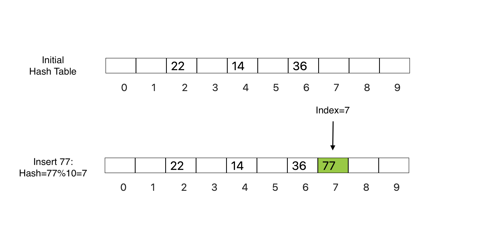

### Insert Operation

Now that we know the basics of hashing, let's take a look at how insertion takes place in hash tables:

   - Compute the index using hash function.
   - Insert the element in the hash table ( array or linked list ) at the particular index.

### Insert Demonstration

### Search Operation

Let's take a look at how search takes place in hash tables:

   - Compute the index using hash function.
   - Check if the element at the index matches with query element.

### Search Demonstration

### Remove Operation

Let's take a look at how removal takes place in hash tables:

   - Compute the index using hash function.
   - Check if the element at the index matches with query element, if yes then remove the element, otherwise element does not exist in hash table.

### Remove Demonstration

