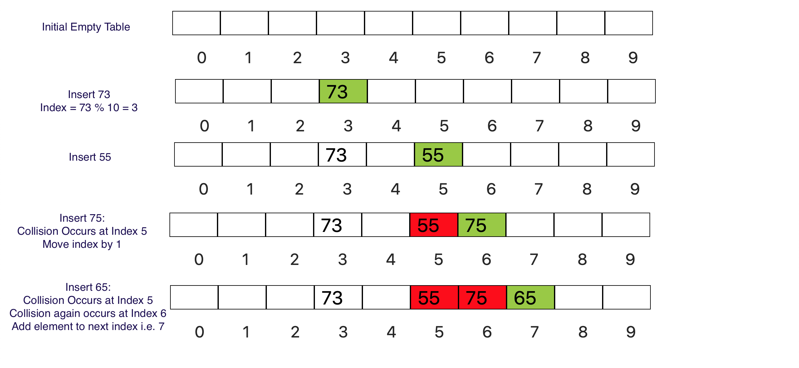

### What is Linear Probing?

  -  In Linear Probing, each cell of a hash table stores a single key–value pair. When the hash function causes a collision by mapping a new key to a cell of the hash table that is already occupied by another key, linear probing searches the table for the closest following free location and inserts the new key there.
  -  Lookups are performed in the same way, by searching the table sequentially starting at the position given by the hash function, until finding a cell with a matching key or an empty cell.

### Linear Probing Demonstration

