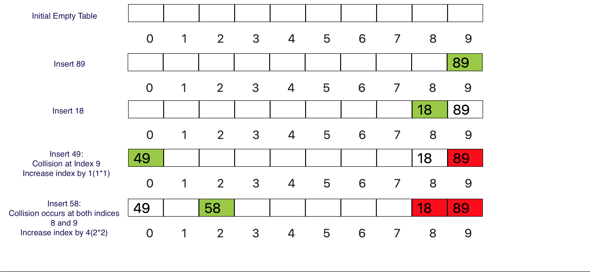

### Quadratic Probing Concept and Algorithm
<iframe src="https://www.youtube.com/embed/P2vuPs-cv4M" frameborder="0" allow="autoplay; encrypted-media" allowfullscreen></iframe>

### What is Quadratic Probing?

Quadratic probing is an open addressing scheme which operates by taking the original hash index and adding successive values of an arbitrary quadratic polynomial until an open slot is found.

### Quadratic Probing Demonstration

